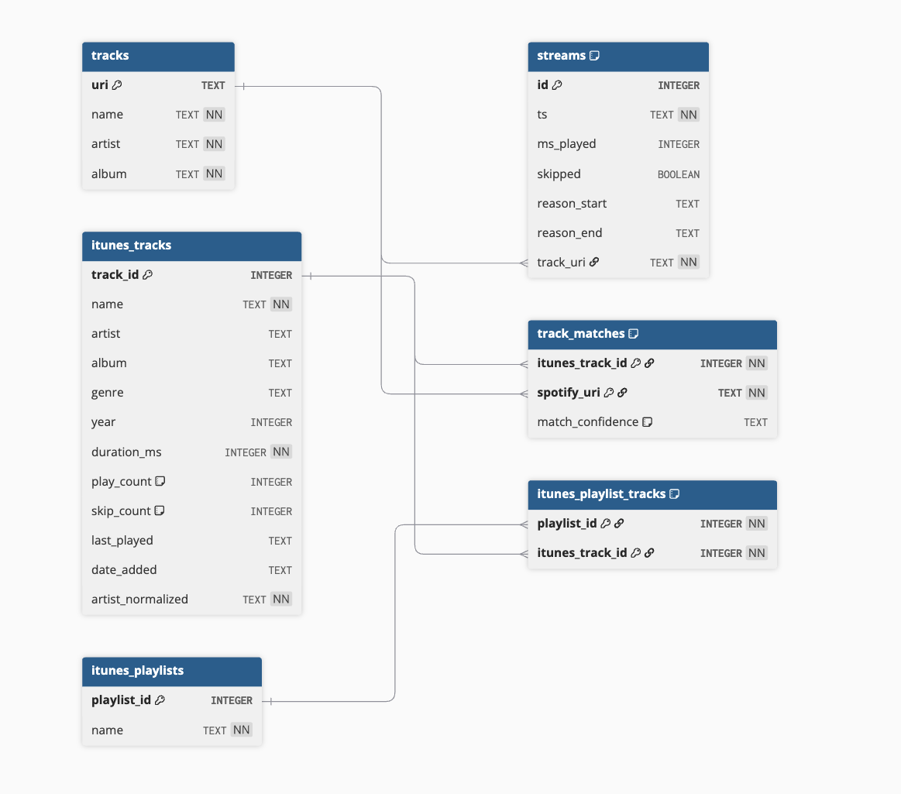

# Listening History Analytics

A personal data pipeline and analytics dashboard that transforms Spotify's exported listening history into a queryable local database and interactive visualization app. Built to understand my own listening habits across nearly a decade of data and rediscover why I enjoy building things that mean something to me. Recently expanded to include iTunes XML library discovered on an old Macbook that I regularly used from 2010-2017. The local database now supports Spotify and iTunes/Apple Music exports.

---

**Overview of Spotify Dashboard**


**Habits**


**Phases**


---

## A Note on Process

This project was built collaboratively with Claude, Anthropic's AI. The architecture, schema design, and key engineering decisions were worked through in conversation, with Claude acting as a guide and sounding board for troubleshooting. Most the code itself was written by me.

---

## Motivation

Spotify gives you access to your full listening history as JSON exports but does nothing useful with it analytically. I wanted a way to actually query that data, find patterns, and understand how my taste and habits have shifted over time.

As the project evolved, I cam across an old Macbook and extracted the hard drive. Among the trove of data, I found my old iTunes library with all the playlists I made and music I downloaded back in the day. The prospect of including this into the dattaset excited me greatly because now I had two disparate data sources from two distinct time periods in my life. I look forward to expanding the dashboard to include these new discoveries as I come across them.

---

## What It Does

**The pipeline** takes raw JSON files from Spotify's data export and loads them into a normalized SQLite database. The result is a queryable dataset covering years of listening history with behavioral metadata including play duration, skip events, and how each track was started and ended. If an XML library from Apple is found in the `data` directory, the pipeline also runs a separate pipeline to include that data.

**The dashboard** is a Streamlit app with three tabs built on top of that database:

- **Overview** — Listening volume by year with a range slider, top artists, and top tracks
- **Habits** — Time of day bar chart with timezone-corrected local hours, reason_start and reason_end donut charts showing deliberate vs passive listening behavior
- **Phases** — Year and month selector showing a time capsule view of top artists and tracks for any given month in the listening history

---

## Project Structure

```text
project/
├── assets/                # Static assets (e.g., schema diagrams)
├── data/                  # Spotify/iTunes data export files (not committed)
├── pipeline/              # ETL pipeline modules and transformations
├── tests/                 # Unit tests for pipeline and database logic
├── app.py                 # Streamlit app layout and tab logic
├── data_funcs.py          # Cached data loading and preprocessing functions
├── db.py                  # Database connection, schema, and inserts
├── fetch_recent.py        # Spotify API live feed script
├── listening_history.db   # The compiled SQLite relational database (not committed)
├── main.py                # Pipeline entry point
├── models.py              # Typed dataclasses representing the data
├── queries.py             # SQL strings for raw table queries
├── requirements.txt       # Project dependencies
├── utils.py               # Pure helper functions and HTML renderers
└── verify_db.py           # Utility script to verify data integrity
```

---

## Schema



### Database Schema Definitions

The database utilizes a normalized architecture to isolate time-series streaming events from static library snapshots, using junction tables for cross-platform entity resolution.

---

#### `tracks` (Spotify Dimension)

Stores one row per unique piece of Spotify content.

| Column | Type | Notes / Constraints |
| --- | --- | --- |
| `uri` | TEXT | **Primary Key.** Spotify's unique identifier. |
| `name` | TEXT | Track title. |
| `artist` | TEXT | Artist name. |
| `album` | TEXT | Album name. |

---

#### `streams` (Spotify Events)

Stores one row per Spotify listening event (time-series log).

| Column | Type | Notes / Constraints |
| --- | --- | --- |
| `id` | INTEGER | **Primary Key.** Auto-generated. |
| `ts` | TEXT | ISO 8601 timestamp in UTC. |
| `ms_played` | INTEGER | Milliseconds actually listened. |
| `skipped` | BOOLEAN | Whether the track was skipped. |
| `reason_start` | TEXT | How playback started (e.g., trackdone, click). |
| `reason_end` | TEXT | How playback ended. |
| `track_uri` | TEXT | **Foreign Key** referencing `tracks.uri`. |

> **Note:** A `UNIQUE(ts, track_uri)` constraint prevents duplicate event logging.

---

#### `itunes_tracks` (iTunes Dimension)

Stores historical aggregate snapshots of the local iTunes/Apple Music library.

| Column | Type | Notes / Constraints |
| --- | --- | --- |
| `track_id` | INTEGER | **Primary Key.** Apple's persistent ID. |
| `name` | TEXT | Track title. |
| `artist` | TEXT | Artist name. |
| `album` | TEXT | Album name. |
| `genre` | TEXT | Assigned genre. |
| `year` | INTEGER | Release year. |
| `duration_ms` | INTEGER | Total track duration in milliseconds. |
| `play_count` | INTEGER | Historical play count (Default: 0). |
| `skip_count` | INTEGER | Historical skip count (Default: 0). |
| `last_played` | TEXT | Timestamp of the last local playback. |
| `date_added` | TEXT | Timestamp the track was added to the library. |
| `artist_normalized` | TEXT | Cleaned artist string for improved matching. |

---

#### `track_matches` (Entity Resolution)

A dedicated junction table that links local iTunes tracks to Spotify URIs.

| Column | Type | Notes / Constraints |
| --- | --- | --- |
| `itunes_track_id` | INTEGER | **Composite PK / FK** referencing `itunes_tracks.track_id`. |
| `spotify_uri` | TEXT | **Composite PK / FK** referencing `tracks.uri`. |
| `match_confidence` | TEXT | Indicates match quality (`exact` or `fuzzy`). Default: `fuzzy`. |

---

#### `itunes_playlists` (Playlist Dimension)

Stores unique local playlist metadata.

| Column | Type | Notes / Constraints |
| --- | --- | --- |
| `playlist_id` | INTEGER | **Primary Key.** Unique playlist identifier. |
| `name` | TEXT | The name of the playlist. |

---

#### `itunes_playlist_tracks` (Playlist Mapping)

A junction table resolving the many-to-many relationship between iTunes playlists and tracks.

| Column | Type | Notes / Constraints |
| --- | --- | --- |
| `playlist_id` | INTEGER | **Composite PK / FK** referencing `itunes_playlists.playlist_id`. |
| `itunes_track_id` | INTEGER | **Composite PK / FK** referencing `itunes_tracks.track_id`. |

---

## Design Decisions

**On evolving complexity.**
My instinct early on was to model the initial Spotify data with heavy fragmentation. That instinct wasn't wrong, but it was premature. I started with a strict two-table design (events and dimensions) because that was all I needed for the analytics dashboard, but when I uncovered an old hard drive with a treasure trove of old iTunes data, I knew the schema had to evolve. When the requirements expanded to include local iTunes library integration, the architecture cleanly scaled to include junction tables for confidence-scored entity resolution without breaking the core time-series logic.

**On normalization.**
Track metadata like artist and album name repeats across every listening event. Storing it once in a tracks table and referencing it by URI keeps the data clean and makes aggregation queries straightforward. A stream record says what happened and when. A track record says what was played. By isolating these grains, integrating a completely different data source (iTunes) later only required mapping to the existing dimension table, keeping the time-series logs completely untouched.

**On idempotency.**
The pipeline uses `INSERT OR IGNORE` throughout. Running it multiple times against the same files or overlapping exports never creates duplicate rows. When developing the iTunes ingestion pipeline, I wanted a way to seemeless commit the new data without the potential of messing with the integrity of the database data. I included constraints in fields to not enter repeated tracks, as well as a condition to only run the spotify or iTunes pipeline. This was a deliberate design choice that makes the pipeline safe to run repeatedly as new export files arrive as the idea is to continually populate the database with new Spotify JSON imports as they arrive.

**On timezone correctness.**
All timestamps are stored in UTC. The dashboard converts them to US/Central before any grouping or aggregation. This is a non-negotiable correctness requirement: extracting hours directly from UTC timestamps would systematically misrepresent listening behavior. A stream played at 8 AM local time stores as 14:00 UTC. Without conversion, the dashboard would report it as an afternoon listen. Every time-based chart in the Habits and Phases tabs is built on timezone-corrected data.

---

## On the API Layer

`fetch_recent.py` was built to keep the database current between exports by pulling from Spotify's recently played endpoint. The implementation worked. The data did not.

Spotify's recently played endpoint has a documented inconsistency in what `played_at` represents. Sometimes it is when a track started, sometimes when it ended. The endpoint also has known phantom entry bugs and returns no behavioral fields: no play duration, no skip status, no reason for starting or ending. The entire analytical value of this project depends on those fields.

Injecting thin, unreliable API data into a database built around behavioral analysis would corrupt the integrity of what the export data provides. The decision to scope the API layer out of production use was a data quality decision made after actually interrogating the source.

`fetch_recent.py` remains in the project because the reasoning process is part of the work. In practice, periodic re-export from Spotify is the right approach for keeping the timeline current.

---

## Running It Yourself

1. **Request data from Spotify**

Request your extended streaming history from Spotify at Settings > [Privacy](https://www.spotify.com/us/account/privacy/) > Download your data. Select Extended streaming history. Spotify emails it within a few days.

2. **Initialize the project**

```bash
git clone https://github.com/jacastanon01/spotify-listening-pipeline.git
cd spotify-listening-pipeline
python -m venv .venv
source .venv/bin/activate
pip install -r requirements.txt
```

3. **Import data into project directory**
 
Create an empty directory and name it `data` or something similar. Open `main.py` and confirm the new directory name matches the string set in the `DATA_DIR` variable. Drop your JSON files into the new folder and run the pipeline:

```bash
python main.py
```

4. **Run app**
Confirm the `listening_history.db` sqlite database was created in your root directory. Then launch the dashboard:
```bash
streamlit run app.py
```
