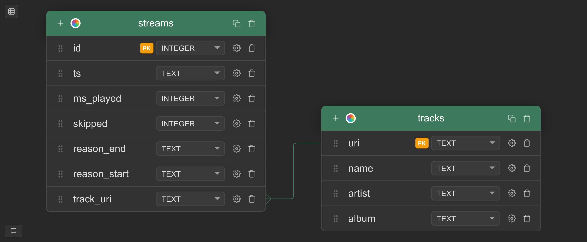

# Spotify Listening History Pipeline — Progress Notes

## (Phase 1)

A local ETL pipeline that ingests Spotify listening history from exported JSON files into a normalized SQLite database.

### Project Structure

```
project/
├── .venv/
├── data/               # Spotify JSON export files
├── main.py             # Orchestrator, entry point
├── pipeline.py         # Data loading, filtering, transformation
├── db.py               # Database connection, schema, inserts
├── models.py           # Typed dataclasses (Track, Stream)
├── test_pipeline.py    # Unit tests
├── requirements.txt
└── .gitignore
```

### Schema

> The `streams` table contains a foreign key to the `track_uri` creating a many-to-one relationship. There can only be one event in time, but I can listen to the same track over and over. For this reason, `track_uri` is a row in both tables while the `tracks` exist as its own piece of information within the database.

Two normalized tables connected by a foreign key relationship.

**tracks** — one row per unique song
- `uri` (primary key)
- `name`
- `artist`
- `album`

**streams** — one row per listening event
- `id` (auto-generated primary key)
- `ts`
- `ms_played` (nullable)
- `skipped` (nullable)
- `reason_start` (nullable)
- `reason_end` (nullable)
- `track_uri` (foreign key → tracks.uri)

### Key Concepts Applied

- **Separation of concerns** — each module owns one job
- **Typed Python** — dataclasses with type hints throughout
- **Idempotency** — `INSERT OR IGNORE` so the pipeline can run repeatedly without duplicating data
- **Data validation** — required fields are guarded before dataclass construction, failing loudly with `ValueError`
- **Unit tests** — pytest covering `is_track`, `convert_to_dataclasses`, and validation edge cases

---

## What the Pipeline Does

1. Finds all JSON files in the `data/` directory
2. Loads and filters each file, keeping only track records (not episodes)
3. Validates required fields on each record
4. Converts each record into a `Track` and `Stream` dataclass pair
5. Inserts both into SQLite, skipping duplicates silently
6. Commits once after all files are processed

---

## Analytics Queries

_Results to be pasted below each query after running._

**Top 10 most played artists by total listening time:**
```sql
SELECT t.artist, SUM(s.ms_played) / 60000 as minutes_played
FROM streams s
JOIN tracks t ON s.track_uri = t.uri
GROUP BY t.artist
ORDER BY minutes_played DESC
LIMIT 10;
```
_Results:_
```
Deafheaven|1647
Radiohead|1475
Death|1443
Frank Ocean|1368
Björk|1343
Interpol|1235
Carcass|1163
Sleepy Dogs|1147
Arcade Fire|972
The Beatles|877
```
---

**Top 10 most played tracks by play count:**
```sql
SELECT t.name, t.artist, COUNT(*) as play_count
FROM streams s
JOIN tracks t ON s.track_uri = t.uri
GROUP BY t.uri
ORDER BY play_count DESC
LIMIT 10;
```
_Results:_
```
Falling Apart|Slow Pulp|82
Under A Serpent Sun|At The Gates|76
Pink + White|Frank Ocean|72
White Ferrari|Frank Ocean|70
What Once Was|Her's|66
Mad Riches|Sonder|63
Do You Feel Nothing?|Greet Death|61
He Can Only Hold Her|Amy Winehouse|61
Metallic Taste|Show Me the Body|59
Pretty In Possible|Caroline Polachek|56
```
---

**Listening volume by year:**
```sql
SELECT strftime('%Y', s.ts) as year, COUNT(*) as plays
FROM streams s
GROUP BY year
ORDER BY year;
```
_Results:_
```
2013|17
2015|10
2016|67
2017|3628
2018|14725
2019|13296
2020|8315
2021|5145
2022|8619
2023|6192
2024|7909
2025|11165
2026|5120
```
---

**Tracks with the highest skip rate:**
```sql
SELECT t.name, t.artist, AVG(s.skipped) as skip_rate, COUNT(*) as play_count
FROM streams s
JOIN tracks t ON s.track_uri = t.uri
WHERE s.skipped IS NOT NULL
GROUP BY t.uri
HAVING play_count > 5
ORDER BY skip_rate DESC
LIMIT 10;
```
_Results:_
```
When You Gain Something, You Have to Sacrifice Something Else|Brad Oberhofer|1.0|6
Satellite of Love|Afterimage|1.0|6
FIELD TRIP|¥$|1.0|6
Great Mass of Color|Deafheaven|1.0|6
Territory|Sepultura|1.0|10
Take A Rest|Gang Starr|1.0|7
Rotten Apple|Alice In Chains|1.0|7
Feel the Pain|Dinosaur Jr.|1.0|6
Heavy Metal aka ejecto seato!|Earl Sweatshirt|1.0|8
It's Smokey Outside and I'm Afraid|Dutch Interior|1.0|6
```
---

## Phase 2 — Plan: Live Feed via Spotify API

### The Goal

Right now the database is a static snapshot from the export. Phase 2 makes it live: a script that can be run at any time to pull in recent listening history and append it to the same database.

### The Concept

The Spotify Web API has a recently played endpoint that returns up to 50 of your most recently played tracks. The plan is a standalone script `fetch_recent.py` that:

1. Authenticates with Spotify on your behalf
2. Fetches recent tracks
3. Translates the API response into the same `Track` and `Stream` dataclasses
4. Inserts them into the existing database using the same insert functions

### Authentication Overview

Spotify uses OAuth 2.0. The flow works in two phases:

**One time setup:** A browser window opens, you log in and approve access. Spotify issues a refresh token which is saved locally. This happens once.

**Every run after:** The script reads the saved refresh token, exchanges it for a fresh access token silently, and makes the API call. No browser, no interaction required.

Credentials (`client_id`, `client_secret`, `redirect_uri`) live in `.env` and are never committed to git.

### Tools

- `spotipy` — Python wrapper for the Spotify API, handles OAuth token management automatically
- `python-dotenv` — loads `.env` variables into the environment

### Cursor Strategy

The endpoint always returns the last 50 plays regardless of what's already in the database. To avoid unnecessary work, after each successful fetch the script saves the `played_at` timestamp of the most recent track. The next run passes that timestamp as the `after` parameter so Spotify only returns plays that happened after the last sync.

### What Stays the Same

- `models.py` — untouched
- `db.py` — untouched  
- `insert_track` and `insert_stream` — untouched
- The database schema — untouched

The only additions are `fetch_recent.py` and a mechanism to persist the cursor between runs.